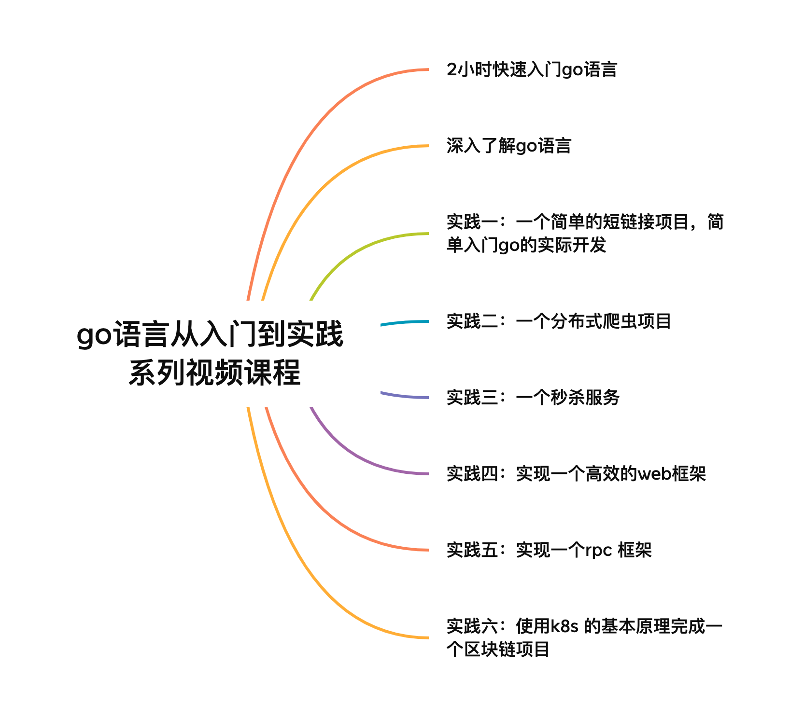

# GO 语言从入门到实践系列视频教程

- b站：https://space.bilibili.com/478621088/channel/seriesdetail?sid=2708643&ctype=0
- 微信公众号：科科人神 （关注公众号，每次更新都能最早发现）
- 微博：https://weibo.com/u/1949695097?tabtype=newVideo
- 抖音：https://www.douyin.com/collection/7156553111618881539/1?previous_page=personal_homepage

## 本教程使用的参考资料有
- https://gobyexample.com/
- https://github.com/shgopher/GOFamily/
- https://time.geekbang.org/column/intro/100079601?tab=catalog
- https://time.geekbang.org/column/intro/100090601
- https://coding.imooc.com/class/chapter/180.html#Anchor
- https://time.geekbang.org/column/intro/100017501
- https://time.geekbang.org/column/intro/100091501
- https://github.com/cloudwego
- https://github.com/polarismesh
- https://github.com/kubernetes
